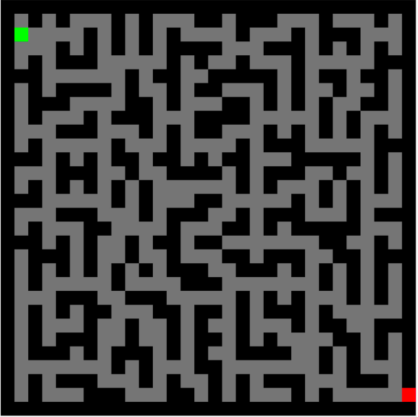

# 2D_Maze_Optimal_Algorithm_Design_based_on_Genetic_Algorithm
 My goal is to find a way from start point(the green block) to end point(the red block) with Genetic Algorithms in the maze(as shown in picture). The maze is stable(size: 30*30) which is inputed by tester. The black block means “wall” which can’t be passed through, and the gray block means the available path. I aim to find a way between start and end point in the maze with the Genetic Algorithms, not the shortest path.
 

## Configuration Parameters
- Initial population : 1000
- Proportion of organisms that survive:0.5
- Fecundity of mating : 2(2 offspring per pair)
- Generations to reproductive maturity: 1
- Max number of generations: 10000