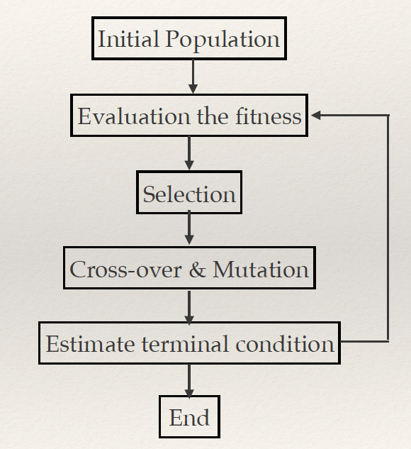
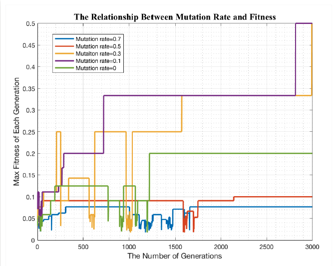
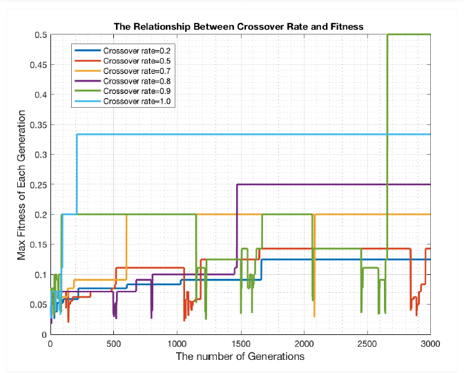
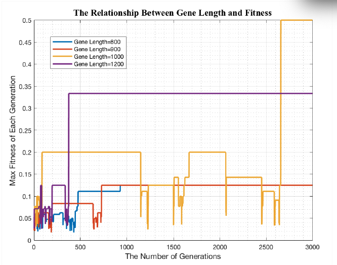
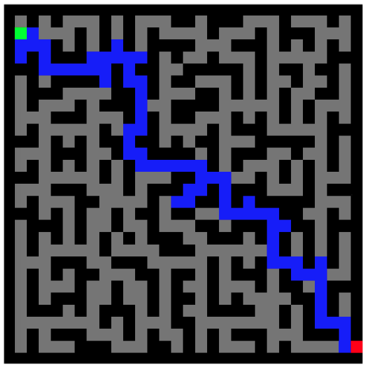

# 2D_Maze_Optimal_Algorithm_Design_based_on_Genetic_Algorithm
 My goal is to find a way from start point(the green block) to end point(the red block) with Genetic Algorithms in the maze(as shown in picture). The maze is stable(size: 30*30) which is inputed by tester. The black block means “wall” which can’t be passed through, and the gray block means the available path. I aim to find a way between start and end point in the maze with the Genetic Algorithms, not the shortest path.

## Configuration Parameters
- Initial population : 1000
- Proportion of organisms that survive:0.5
- Fecundity of mating : 2(2 offspring per pair)
- Generations to reproductive maturity: 1
- Max number of generations: 10000

### Analysis & Finding:
In the Genetic Algorithms some factors like Mutation rate, Crossover rate and Gene length will affect the final results.Our group designed some tests to find the best value of these parameters.
1. The Relationship Between Mutation rate and Fitness Score：
The picture shows the relationship between different mutation rates and fitness scores within 3000 generations. When the mutation rate is high,the fitness score fluctuated obviously with the number of generations increased. However, when the mutation rate is low, like the green line in the picture, the fitness score remain the same after 1200 generations.In conclusion, from the picture I can get that the suitable mutation rate is between 0.1-0.3. Finally, I select 0.2 as the mutation rate.

2. The Relationship Between Crossover rate and Fitness Score：
The picture shows the relationship between different crossover rates and fitness scores within 3000
generations. When the crossover rate is low, the fitness score fluctuated unobviously with the number of generations increased. However, when the crossover rate is high, like the green and blue line in the picture, the fitness score is reached into 0.5, which means the individual reached the exit of maze.In conclusion, from the picture I can get that the suitable crossover rate is between 0.8-1.0. Finally, I select 0.9 as the crossover rate.

3. The Relationship Between Gene Length and Fitness Score：
The picture shows that the relationship between different Gene Length and fitness scores within 3000
generations. Because the Gene Length means the number of steps that each individual can take in the maze. The program stops only when the final step reaches the exit. So when the gene length equals to 800 and 900, the number of the steps is not enough to get the exit point. But if the gene length is too long, it will make the route repeated.In a word, in the maze problem, I should select a suitable gene length, not too long or short. In this project, I chose Gene length equals to 1000.

### Conclusions:
- By using Genetic Algorithms, I could have more probability to select individual who has the better fitness to generate high-quality solution.(In this case, it’s to find the fittest route of all individuals from entrance to exit in the maze )
- According to the maze map, to get the best optimal genetic algorithms model, I chose mutation rate=0.2, crossover rate=0.9, gene length=1000 as parameters. Based on multiple tests, with these parameters, There's a high probability of getting a result in 3000 generations.

